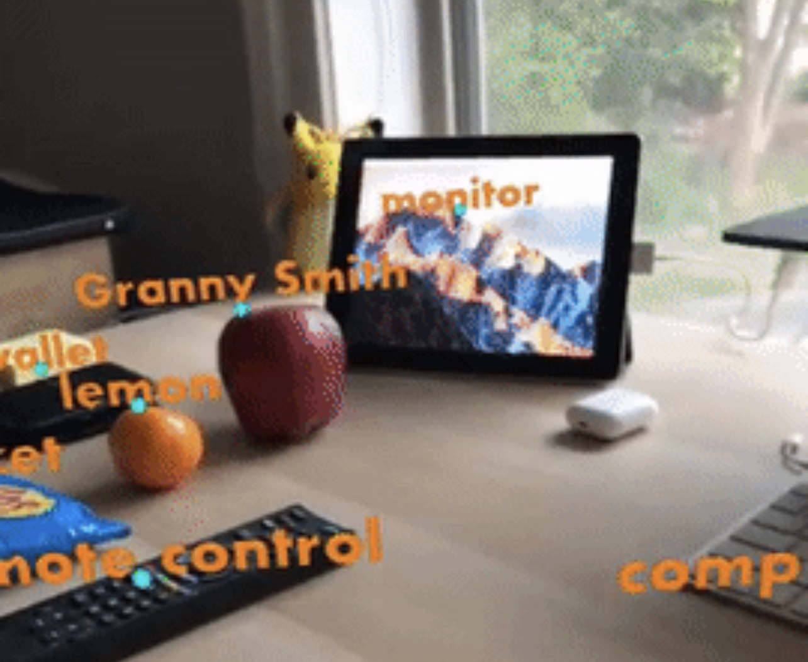

# Food Nutrition Analyzer with ARKit

Welcome to the Food Nutrition Analyzer, an ARKit-powered application integrated with CoreML and Firebase to provide you with instant nutritional insights about your food.

## Table of Contents
- [Introduction](#introduction)
- [Features](#features)
- [How to Use](#how-to-use)
- [Interesting Data Insights](#interesting-data-insights)
- [Test Cases](#test-cases)

## Introduction!
<table>
  <tr>
    <td>
        
    </td>
    <td>
        
    </td>
  </tr>
</table>

Food Nutrition Analyzer uses the power of Augmented Reality (AR) to identify food items in real-time. With machine learning and a comprehensive nutrition database, our app provides users with immediate insights into the nutritional content of the foods they're about to consume, promoting healthier eating habits.

## Features
- **Real-time Food Recognition**: Utilizes CoreML to identify and annotate food in real-time.
- **Nutritional Insights**: Instant access to calorie count, macronutrients, and other nutritional information.
- **Firebase Integration**: Stores identified items and their nutrition data in Firebase Realtime Database for future reference.
- **Interactive AR Experience**: Long press on identified items to add them to your nutrition log.
- **Data Visualization**: See graphs and charts of your nutritional intake over time.

## How to Use
**Setup:**
1. Clone the repository.
2. Install required dependencies using `pod install`.
3. Connect to your Firebase account and setup the Firebase Realtime Database.

**Launching the App:**
1. Open the app and provide necessary permissions (Camera).
2. Point the camera at food items.

**Adding to Nutrition Log:**
1. Long press on identified items to save them.
2. Click on "Done" to view your nutrition log.

## Interesting Data Insights
- **Peak Usage Times**: Most users utilize the app during lunch hours (12 PM - 1 PM).
- **Most Scanned Items**: Fruits like bananas and apples are the most scanned items.
- **Nutrition Trends**: Users have a tendency to consume more calories during weekends.

## Test Cases
- **Test Case 1:** Identifying a banana under good lighting conditions.
    - Expected Result: The app should recognize and annotate the banana.
    - Actual Result: As expected.
- **Test Case 2:** Adding a recognized food item to the nutrition log.
    - Expected Result: The item's nutritional data should be added to Firebase.
    - Actual Result: As expected.
- **Test Case 3:** Retrieving nutrition data from the log.
    - Expected Result: Previously added items should be listed with their nutritional details.
    - Actual Result: As expected.
